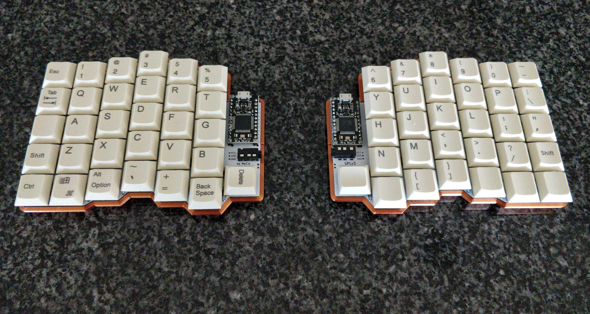

# splitreus62

- [Atreus](https://github.com/technomancy/atreus) Phil Hagelberg
- [Atreus62](https://github.com/profet23/atreus62) Profet23

All these files were created from scratch, but out of respect for Phil I wanted to GPLv3 the project. 

Thanks to Phil for the staggering measurements from the atreus, and profet23 for the 62 key variant. 

### Features: 
- Reversible PCB supports MX/Alps/Choc Modified from keebio footprint.
- Pro Micro Footprint borrowed from the Lily58.
- supports SMD and through hole diodes.
- Breakout pins for led underglow.

### Known issues:
- SMD Diode footprint is only on the back-copper layer, so diodes have to be mounted on the bottom of the left half and the top of the right half.

## Build Guide (Coming soon)
