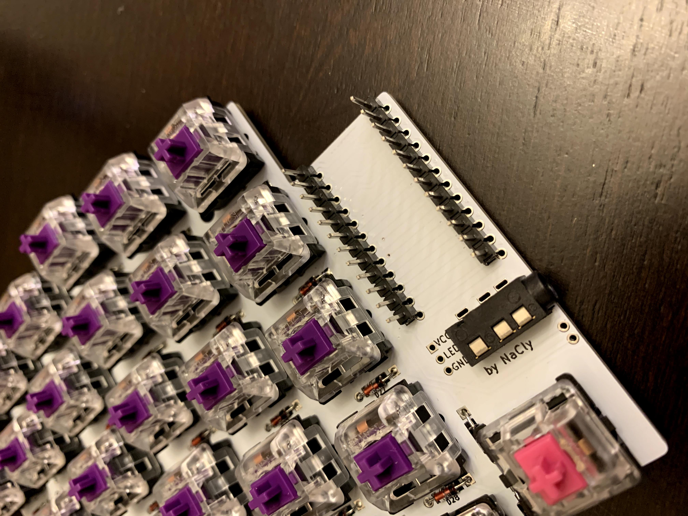
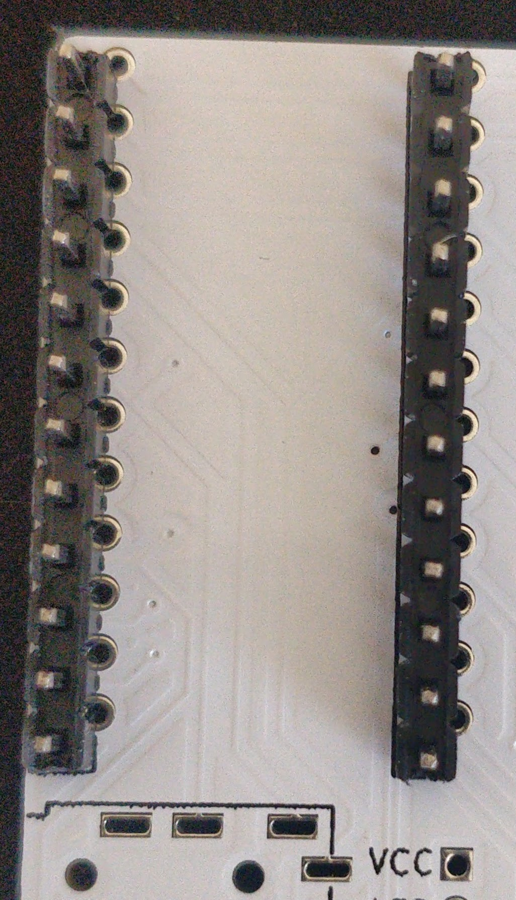

# Build Guide (WIP)
* Thanks to Lucas for the photos used in the build guide. [Github](https://github.com/layertwo)
## Steps
The only order of steps that matter are diodes before switches. Other than that it's pretty much up to you. I prefer the order listed below.

_Note: this build guide uses the low profile case that is compatible with pcb mounted switches. A case is in the works for plate mounted switches. There is a sandwich case available as well, but it is currently only been tested as a 3d print and not as metal._

### I always suggest doing switches last because they are usually the most expensive part of my builds. 
### Suggested order:
 - Diodes
 - TRRS
 - Pro micro headers (multimeter headers if possible to make sure there are no shorted pins)
 - Pro micro to headers
 - Switches

#### Diodes
- through hole diodes can be soldered on top of the pcb, or below. The low profile case requires the diodes be placed on top of the pcb. 
- The black line on the diode will always face the square pad on the pcb.

Make sure to test your diodes before soldering the switches in. If you do not have a multimeter I suggest flashing the pro micros and using a paper clip or wire to short each switch to make sure the diodes are all working.

#### TRRS
- TRRS is straight forward. It only fits in 1 orientation per side if placed on top.

#### Bottom of TRRS

#### Pro Micro Left and right hands
_NOTE: It is very important that you do not bridge pins from one set of pro micro pads to the other. This could result in the pro micro not powering on, getting stuck in reset mode, or could even end up frying the pro micro. Go easy on the solder._
- I reccomend soldering on headers to the PCB before soldering the headers onto the pro micro. It is much easier to fix any soldering mistakes with just the headers on the PCB. 
- If you have a multimeter it's a good idea to make sure no adjacent pins are connected after soldering. 
- Pro micro always uses the left most set of pads when the pcb is face up.  
- Picutres of left and right sides

#### Left

#### Right

#### Switches
- Nothing special here, except choc switches are roatated 180 degrees. This allowed for a reversible footprint for MX/Alps/Choc.

#### Case (low profile)
##### _Uses 5 m3x4 per half (m3x5 also work)_
- Before putting on keycaps mount the PCB to the case using the screws.
